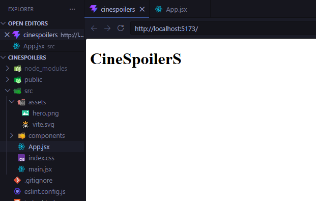
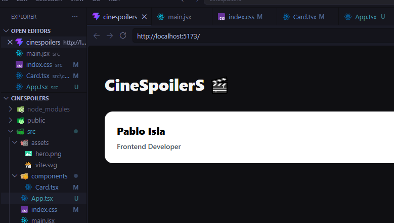
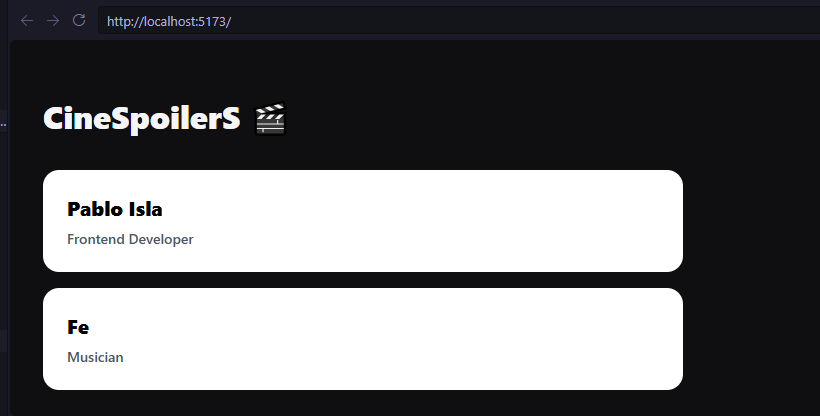
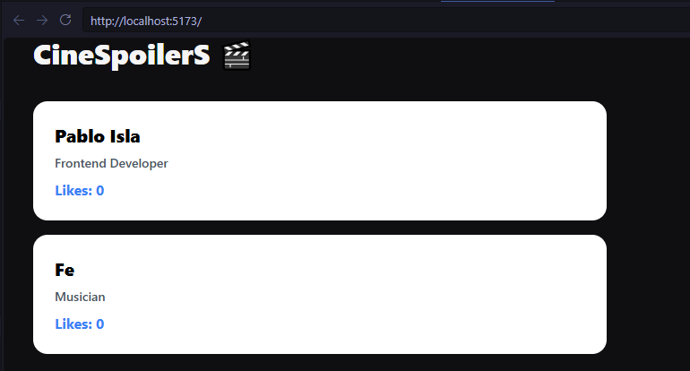
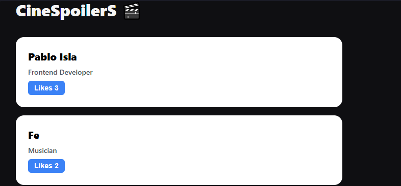

# 🎬 LABORATORIO: FUNDAMENTOS DE REACT - CINESPOILERS

Frontend interactivo desarrollado con React y TypeScript para la gestión visual de CineSpoilerS.

---

## 🚀 PRUEBA 1: Proyecto limpio, renderizado y sin errores

---

## 🎥 PRUEBA 2: Creación de componente con variables y uso

---

## 🏷️ PRUEBA 3: Props en el componente creado (Comunicación)

---

## 🔗 PRUEBA 4: Estado en el componente (useState)

---

## 🔗 PRUEBA 5: Manejo de estado mediante eventos (onClick)

---

## 📌 TECNOLOGÍAS
- React
- TypeScript
- Vite
- CSS3 (Estilos personalizados)

---

## 👨‍💻 Equipo de Desarrollo
- Ingrediente: Pablo Isla
- Ingrediente 2: Piero Huaytalla
- Ingrediente 3: Andy Campos